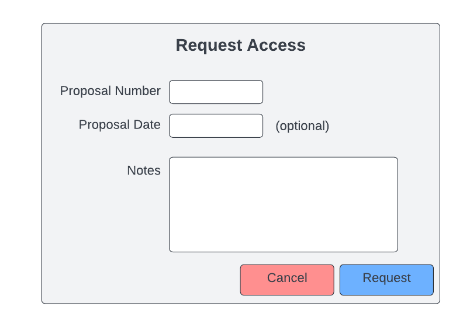

.. _`intersect:arch:sos:user:interfaces:user:detailedview`:

Detailed View of a Resource
~~~~~~~~~~~~~~~~~~~~~~~~~~~

.. _`intersect:arch:sos:user:interfaces:user:detailedview:preconditions`:

Preconditions
^^^^^^^^^^^^^

User is registered and logged into INTERSECT

.. _`intersect:arch:sos:user:interfaces:user:detailedview:postconditions`:

Postconditions
^^^^^^^^^^^^^^

User can see a detailed view of their physical or logical resource

.. _`intersect:arch:sos:user:interfaces:user:detailedview:methodologies`:

Methodologies
^^^^^^^^^^^^^

* Physical resources - instruments, compute, data, network

* Properties shown in listing

  - Title (abbreviate if necessary)
  - Thumbnail image (if available)
  - Current status

* Detailed view:

  - Title
  - Resource ID
  - Resource Classification. E.g. - Physical.Microscope.STEM
  - Description with:

    - Capabilities - this will invariably point to the modularity of the resource, allowing components to be swapped out to suit Campaigns better.
    - Examples of when and when not to use it
    - Examples of how to provide parameters if applicable

  - Thumbnail image
  - Images - of the different instrument setups
  - Performance metrics - or link to vendor’s spec sheet
  - Actions

    - listing of key actions one can perform with this resource very similar to any existing API documentation
      * Function name
      * Description of action
    - Link to full list of supported actions / documentation page
      
  - Availability
    
    * Current: Use same colors and symbols as listed above.
    * Future: show calendar w/ lead time (to setup) for instruments

  - Operator / Maintainer information
    
    * Setup / tear-down times
    * Operator / Maintainer? What if there are several - the User doesn’t know who would be assigned. Why

  - Access:
    
    * If user doesn’t have access, the User clicks on a button to request access from the Owner
      
      - present a button to request access.
      - The button points to a popup window with a few fields:

	* Proposal number
        * Proposal date (optional)
        * Notes - any notes that would help the Owner validate the User, proposal number
	  against internal processes for their Organization
	  
    * If user does have access - show one of two statuses:
      
      - Under review - yellow / orange
      - Available - green check mark

    * Challenge:

      - INTERSECT will assume that, in reality / practically speaking, Organizations / Owners may already have a proposal process to grant access to their Resource(s) and that these
        processes do not have open APIs to access:

        * components of the proposal (intent, needs, methods, duration… )
	* list of pending proposals
        * state of proposals
        * whether or not a user has been granted access

      - Also, the nature of these proposals will certainly vary widely between Organizations, so it may be overly tedious/pointless to reconcile / mirror / synchronize the INTERSECT interface and organization’s proposal interfaces.
      - The processes to review and approve access also vary wildly.  For example, CNMS’s
        application and review process is entirely over emails. OLCF has a more streamlined
        system on RATS.
      - Furthermore, the process to grant access to a User involves reviewers, etc. who are not
        part of INTERSECT
      - The Owner of this Resource in INTERSECT may not be the same person who runs the
        “Resource Utilization Council” for the Organization.
      - Thus, it is safe to assume that INTERSECT will be out-of-sync with the external
        proposal / access management processes.
      - Therefore, INTERSECT could ask the User to provide the approved confirmation number /
        proposal number that the Owner of the Resource could validate within their internal
        process and allow this User to access the Resource. This allows Owners to incorporate a
        workflow that suits their Organization / Resource to include mandatory training /
        certification before the User is authorized to independently use the Resource.
  - Logs

    * Relevant changes to the resource. E.g. - microscope currently uses the smaller sample
      stage or Cluster upgraded to use RHEL ?.?

  - Listing of past Campaigns / campaigns that this user used this resource:

    * Title
    * Date and time
    * Link

  - Availability of digital twin with link

    * list caveats and other assumptions

  - Campaign template(s):

    * Listing with abbreviated description with link to template

  - Reviews and ratings?

* Logical resources:

  - These can be divided into two categories:

    - Custom / Optimized - these are software applications that:

      * are computationally intensive
      * that are tailored for specific underlying Physical Resource(s), typically for time-sensitive / time-critical applications.
      * may be highly domain-specific
      * are in the form of a software container or a job script on a compute cluster.
      * Examples include:

        - digital twins for physical resources or phenomena,
	- job scripts for simulations that are optimized for one or more specific compute resources
	- deep learning training job optimized for a specific compute resource or architecture (e.g. to take advantage of fixed precision available only on high-end GPUs,
               NCCL, InfiniBand, etc.)
	- large-scale multi-variate statistical analysis code (e.g. pbdR)

    - Versatile - software applications that:

      * are not computationally intensive
      * will not be used for time-sensitive or rate limiting for a real-time Campaign
      * can run on most compute resources, especially the infrastructure that supports INTERSECT’s web interface
      * are specified via containers or functions written in popular languages such as Python or R
      * Examples include:

	- Simple data visualization
	- Simple data analytics / statistics
	- Lightweight inference on pretrained machine learning or deep learning models

  - Properties to show in listing:

    * Title (abbreviate if necessary)
    * Resource ID
    * Thumbnail image (if available)
    * Version number or (better yet:) Last update - when the twin was verified to match with the physical counterpart. This assumes that the physical counterpart does evolve with time and the virtual resource

  - Detailed view:

    * Title
    * Resource ID
    * Resource Classification - E.g. Logical.Analysis.Visualization.2DImage
    * Thumbnail image
    * Images: Especially for visualization Resources; simulation applications could use this space to illustrate benchmarking results, etc.
    * Description

      - Capabilities
      - Comparison with one or more physical counterparts for Digital Twins

	- Assumptions / caveats
	- Turnaround time / response rate?

    * Actions:

      - Listing of key actions that can be performed with this Resource - a subset of the Resource’s API

        * Function name
	* Description of action
	* Link to full listing of all supported actions / documentation

    * Availability:

      - Almost always “Available”.
      - “Down” when Resource is being investigated for bugs or incompatibilities due to changes in dependencies.

    * Access - Almost always “Available” unless licensing restrictions limit access for some reason.
    * Computational resources that can support this Resource; primarily for Custom / Optimized Virtual Resources

      - (Compute) Resource name
      - Supported software version
      - Performance metrics (e.g. response time) or point to existing papers with benchmarking information

	- availability, and “add” button?

	  * “CNMS NVIDIA DGX 2” \| “Available” \| “Add”
	  * “OLCF Frontier” \| “Not Available” \| :math:`<>`

	- Given that the users will not be setting up the application themselves, it may not be necessary to show how the twin should be accessed (e.g. module or container) and set up.

    * Required computational resources (not required since we allow apps to only run on certain resources in an automated manner):

      - Architecture: (e.g. “Requires x86 architecture. Does not work on POWERPC”)
      - CPU: recommend / required CPU cores
      - Host memory: recommended / minimum requirement
      - Acceleration: (e.g. “requires NVIDIA Volta V100 32GB or higher. Does not work on AMD GPUs”)
      - Cluster size: (e.g. “requires 16 nodes with X cores and
      - Storage: (e.g. “100 GB per simulation with these nominal parameters”)
      - Other: (e.g. “Needs InfiniBand, NVLink, half precision, etc.)

    * Logs

      - Relevant version changes listing bug fixes, etc.

    * Listing of Campaigns that used this resource in the past

      - Title
      - Date and time
      - Link

    * Related Resources - Relevant for:

      - Digital Twins
      - Simulation applications that are related to other Physical Resources

    * Reviews and ratings?

  - Button to add a new Resource into INTERSECT

An example interface is depicted in :numref:`figures:user:user:detailedview:detailedphy`,
:numref:`figures:user:user:detailedview:detailedlog` and :numref:`figures:user:user:detailedview:detailedreqacc`

      
   Detailed view of a physical resource.
  
.. figure:: ./fig-userview-detailedlog.png
   :name: figures:user:user:detailedview:detailedlog
   :align: center
   :width: 600
   :alt: An example interface
      
   Detailed view of a logical resource.

   Prompt to request access to a resource for a campaign.
