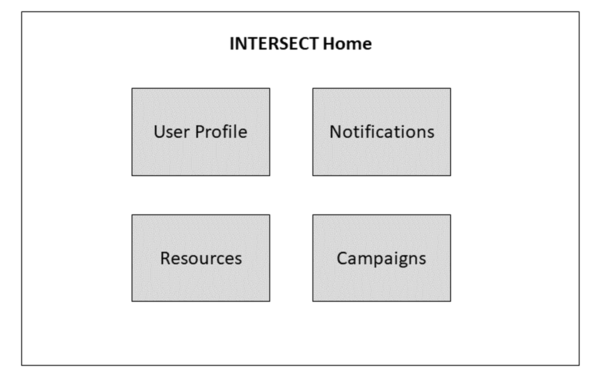

.. _`intersect:arch:sos:user:interfaces:user:login`:

User logs into INTERSECT Dashboard
~~~~~~~~~~~~~~~~~~~~~~~~~~~~~~~~~~

.. _`intersect:arch:sos:user:interfaces:user:login:preconditions`:

Preconditions
^^^^^^^^^^^^^

User has already registered with an account in INTERSECT. User has an account with the chosen federated identity management provider.

.. _`intersect:arch:sos:user:interfaces:user:login:postconditions`:

Postconditions
^^^^^^^^^^^^^^

Upon successfully logging in, the User can now access the INTERSECT dashboard.

.. _`intersect:arch:sos:user:interfaces:user:login:methodologies`:

Methodologies
^^^^^^^^^^^^^

User logs into INTERSECT via the login screen

* Auth method (ORCID, Globus, OneID) :math:`>>` Institution :math:`>>` username :math:`>>` password

An example user INTERSECT dashboard is depicted in :numref:`figures:user:user:login:ex1`.

   A representation of the home-screen that would be displayed once a
   User logs into the INTERSECT web interface..
