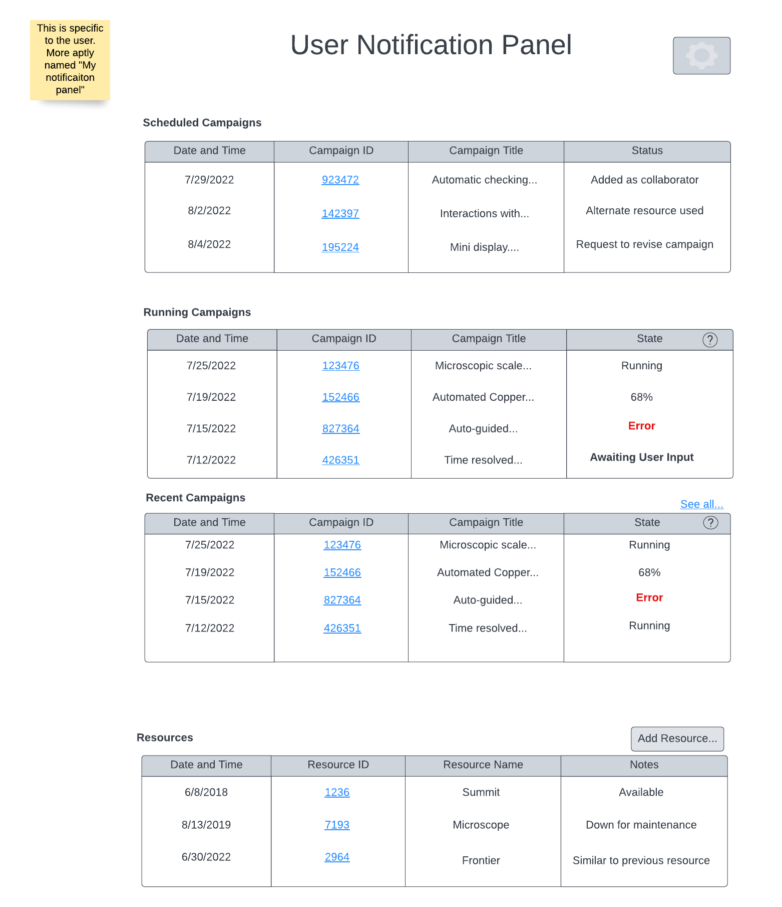

.. _`intersect:arch:sos:user:interfaces:user:notification`:

User Notification Panel
~~~~~~~~~~~~~~~~~~~~~~~

.. _`intersect:arch:sos:user:interfaces:user:notification:preconditions`:

Preconditions
^^^^^^^^^^^^^

The User is registered and logged in to INTERSECT

.. _`intersect:arch:sos:user:interfaces:user:notification:postconditions`:

Postconditions
^^^^^^^^^^^^^^

The user is able to see a notification panel for scheduled, running, and
recent campaigns as well as the resources to which they have access.

.. _`intersect:arch:sos:user:interfaces:user:notification:methodologies`:

Methodologies
^^^^^^^^^^^^^

* The Notifications Panel shown in :ref:`figures:user:user:notification:notif` would be visible only to this User.

* It could have different sections providing tidbits on status updates / actions to take:

  - Campaigns

    * Running Campaigns - Listing view with following columns:

      - Date and time

      - Campaign ID
	
        * For running Campaigns - link takes the User directly to the live dashboard for the Campaign

	* For Campaigns that failed - link that takes the User to the Detailed view of the Campaign

      - Campaign title (abbreviated)
      - State

        * For running Campaigns - display progress this is obvious or just display “Running”
	* For Campaigns that failed - just display “Error” in red to grab attention

    * Scheduled Campaigns - Listing view with following columns:

      - Date and time
      - Campaign ID - link that takes the User to the Detailed view of the Campaign
      - Campaign title (abbreviated)
      - Status messages for situations:

	* Added as a collaborator on another User’s Campaign
        * moving forward because one or more Operators completed setup of their Resources
	* cancelled because one or more critical steps (PI rejected / Resource was unavailable and no alternatives were available) were impossible to complete
	* Alternate Resource used (by Owner / Operator) in place of requested Resource
	* Request to revise Campaign configuration in order to move Campaign forward

  - Resources - Listing view with following columns:

    * Date and Time
    * Resource Name
    * Resource ID
    * Note. Examples include:

      - Resource (frequently used by this User / one this user has access to) taken down for maintenance
      - Resource (frequently used by this User / one this user has access to) that was down is now available for use
      - new Resource similar to those used by User added to INTERSECT

	* This can potentially become annoying. User should have the ability to customize notifications

An example interface is depicted in :numref:`figures:user:user:notification:notif`

     
   Notification panel is specific to each user.
