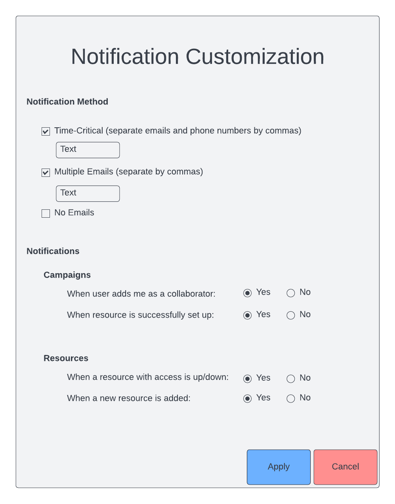

.. _`intersect:arch:sos:user:interfaces:user:notificationcustom`:

Notification Customization by User
~~~~~~~~~~~~~~~~~~~~~~~~~~~~~~~~~~

.. _`intersect:arch:sos:user:interfaces:user:notificationcustom:preconditions`:

Preconditions
^^^^^^^^^^^^^

The User is logged in to INTERSECT and is viewing the Notification
Panel.

.. _`intersect:arch:sos:user:interfaces:user:notificationcustom:postconditions`:

Postconditions
^^^^^^^^^^^^^^

The User is able to edit which notifications they get and how they
receive them.

.. _`intersect:arch:sos:user:interfaces:user:notificationcustom:methodologies`:

Methodologies
^^^^^^^^^^^^^
* The Notifications Panel would have an options button that would reveal a settings menu for notifications. This panel would have the following items:

  - Notification method

    * Time-critical : options to specify one or more email addresses and phone numbers for SMS
    * Other:

      - No email
      - options to specify one or more email address

  - Notifications

    * Campaigns

      - Running
      - Scheduled 

        * When User adds me as a collaborator - Yes / No
	* When Resource is successfully set up - Yes / No

    * Resource
      
      - Up / Down for Resources with access - Yes / No
      - New Resource - Yes / No

An example interface is depicted in :numref:`figures:user:user:notificationcustom:notifcustom`

   Users can choose which notifications to get and how to get them.
