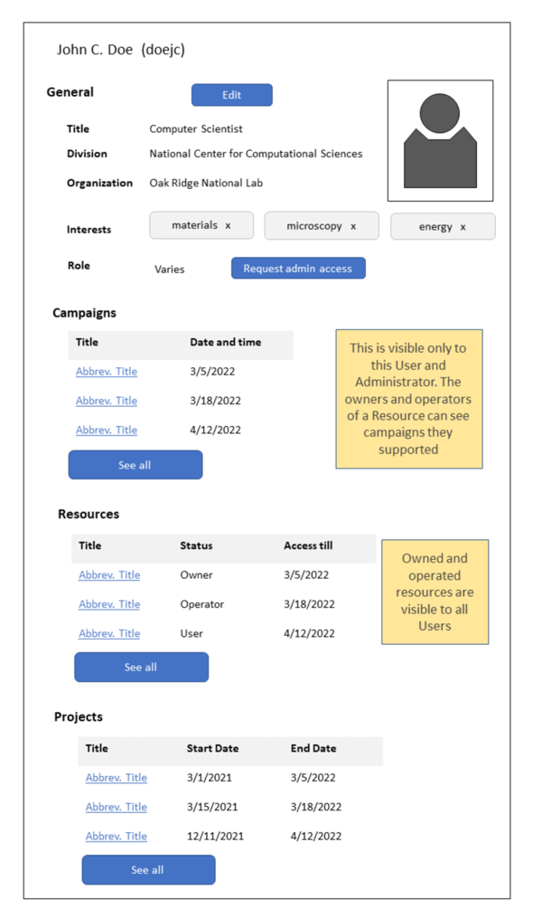

.. _`intersect:arch:sos:user:interfaces:user:profile`:

User Profile
~~~~~~~~~~~~

.. _`intersect:arch:sos:user:interfaces:user:profile:preconditions`:

Preconditions
^^^^^^^^^^^^^

User is registered and logged in successfully.

.. _`intersect:arch:sos:user:interfaces:user:profile:postconditions`:

Postconditions
^^^^^^^^^^^^^^

User can view all details about their profile and be capable of making
changes as necessary.

.. _`intersect:arch:sos:user:interfaces:user:profile:methodologies`:

Methodologies
^^^^^^^^^^^^^

The User Profile is something that others could also probably see to get
an understanding about this User. It would have the following details:

* Username
* Full name
* Thumbnail image of person
* Organization
* Facility within Organization
* Title in Organization
* Role in INTERSECT
* Interests
* Campaign listings (perhaps only the past ones are visible to other Users – see below)
* Resources managed / owned by this User

  - this Owner / Operator gets to see a listing of everything they own / maintain
  - If this User were a Maintainer / Operator of multiple Resources

    * only those Resource(s) owned by the Owner, who is viewing the page, will be displayed.
    * Other regular Users will not be able to see these?

  - an Owner of the Resource(s) can see those Resource(s) listed only relevant to Owner / Maintainer)

* A button to edit certain basic details about their profile

An example user profile is depicted in :numref:`figures:user:user:profile:ex1`

   A representation of a registered User’s profile in INTERSECT with
   options to edit their profile.
