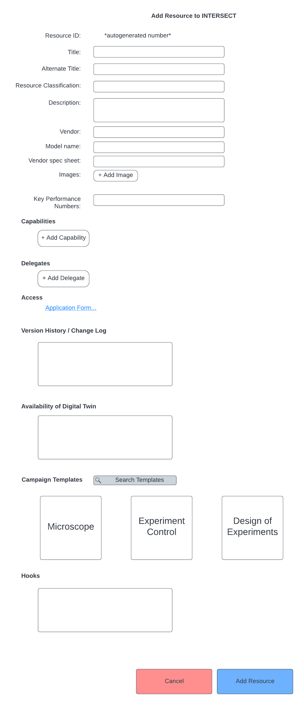
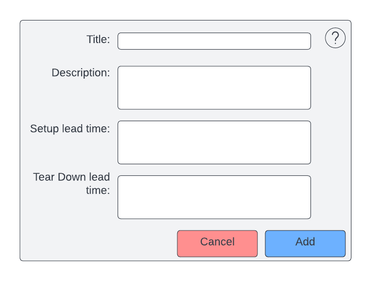

.. _`intersect:arch:sos:user:interfaces:user:requestresource`:

User Requests to Add a New Resource to INTERSECT
~~~~~~~~~~~~~~~~~~~~~~~~~~~~~~~~~~~~~~~~~~~~~~~~

.. _`intersect:arch:sos:user:interfaces:user:requestresource:preconditions`:

Preconditions
^^^^^^^^^^^^^

User is registered and logged into INTERSECT

.. _`intersect:arch:sos:user:interfaces:user:requestresource:postconditions`:

Postconditions
^^^^^^^^^^^^^^

If the request to add the Resource were approved, the User would now be
the Owner of this Resource

.. _`intersect:arch:sos:user:interfaces:user:requestresource:methodologies`:

Methodologies
^^^^^^^^^^^^^

* Basic details:

  - Resource ID: Generated when the Owner starts the process of requesting a new Resource to be added to INTERSECT
  - Title - visible to all Users (public facing). How would a User differentiate seemingly identical Resources?
  - Alternate Title - visible to all but Users - answers the question - do we need another one for internal use? For example, what if there are 6 identical Resources? CNMS has 4 microscopes that are nearly identical and are internally differentiated by a suffix -“East”, “West”, “North”, and “South”.
  - Resource Classification - e.g. ``Physical.Microscope.ScanningTransmissionElectronMicroscope`` or ``Logical.Visualization``.
  - Description - capabilities, assumptions, caveats, recommended usage
  - Thumbnail image
  - Vendor - E.g NVIDIA. Irrelevant to Logical Resources
  - Model Name - DGX II
  - Vendor Spec-sheet - link (relevant to physical resources)
  - Images if relevant (e.g. visualization widgets, scientific instruments)
  - Key performance numbers

* Capabilities / Modes

  - Context: A given Resource may have multiple Capabilities / Modes in which the Resource can be operated / used. For example - measurement modalities in a scanning probe microscope - imaging / spectroscopy / hyperspectral imaging....

  - List of unique capabilities / modes that this Resource is capable of supporting. Per Capability / Mode:

    * Title
    * Description

      - Include caveats / tradeoff in relevant performance metrics that are not obvious to the end User.
      - Setup lead time

        * Duration

	* Operator / Maintainer - A Mode / Capability can be sufficiently nuanced and differentiated that a single Operator / Maintainer may not be knowledgeable enough to handle other Modes / Capabilities of the same Resource.
	  
	  - Editable list of Users (add/remove) - this would be a very simple way to manage privilege elevation from User to Operator / Maintainer. Note that privilege elevation is valid only for this Resource. This User would have the same capabilities as everyone else would for other Resources - i.e - this Operator / Maintainer should not be able to maintain / look into management of another Resource.
	  - If multiple Operators / Maintainers are assigned to this Mode / Capability - logic for INTERSECT to use to automatically pick the most appropriate Operator / Maintainer from the list of Operator / Maintainers. It could be as simple as User X always does the setup and User Y always does the tear-down.

	* Tear-down lead time

	  - Duration
          - Operator / Maintainer

	    * List
	    * Logic

* Delegates

  - Listing of other Owner / Operator / Maintainers who could make edits (typically low-level parameters that the Owner may not be intimately familiar with) to the configuration on behalf of this Owner.
  - This list of Users may overlap with the Operator / Maintainers
  - Perhaps the Owner only fill out the high-level information or just proof-read whatever the Operator / Moderators put together on behalf of the Owner.

* Access

  - Link to application form / page to how a user can gain access
  - Proposal ID field to capture from User - this will be used by Owner to manually lookup proposal within Organization’s access control system / processes and then approve / deny access of this Resource to said User
  - Version history / Change log:

    * Relevant to both physical and software resources

  - Availability of digital twin with link
    * list caveats and other assumptions

  - Campaign template(s):

    * Listing with abbreviated description with link to recommended templates

* Hooks

  - Physical resources:

    * Availability (if relevant)
      
      - Configuration / API call to:

        * query current state
	* future availability
	* Reserve all or part of resource

          - Parameters that need to be passed

        * think of using something like SuperFacilityAPI

          - OR Exchange / Outlook calendar integration

	  - Lead time specified in hours - for configuring the setup of the resource before every Campaign, if relevant (especially for observational resources)

	* INTERSECT Resource Control daemon address (if relevant)
	* Globus Endpoint UUID for data transfers (if relevant)

      - Software resources:
	
        * Per computational resource:

	  - Resource link in INTERSECT
	  - Resource Name
	  - Shell / job script for launching the application

* Links to other resources either as virtual twin to a physical resource, visualization module for streaming data, or analysis results, etc.
    
* Alternate resources upon unavailability - listing

  - If applicable, Owner provides a list of comparable resources that could be used in place of this resource if and when this resource is down.

An example interface is depicted in :numref:`figures:user:user:requestresource:requestres` and :numref:`figures:user:user:requestresource:requestres-cap`

     
   Form to add resource to INTERSECT.

   Capability that resource is capable of supporting.
