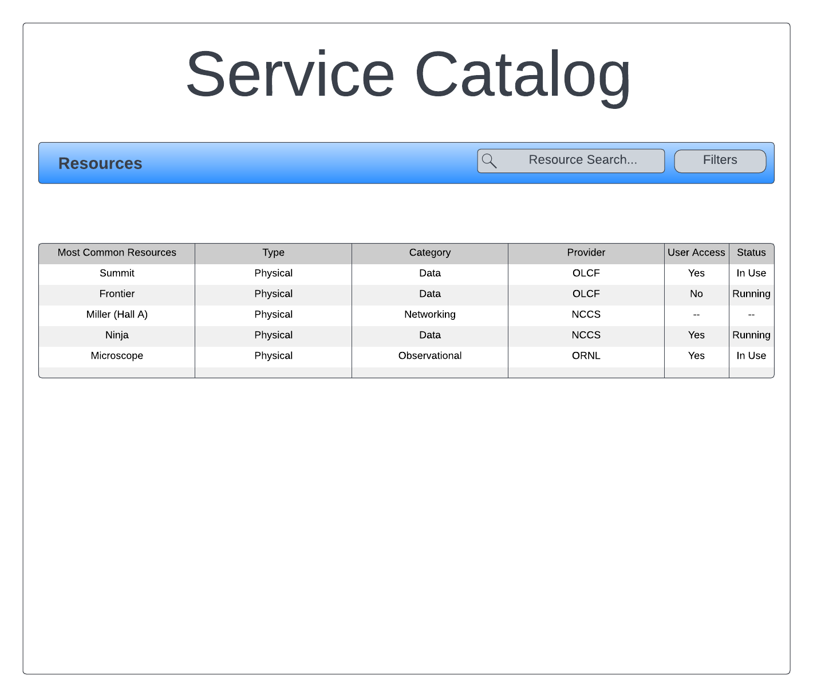
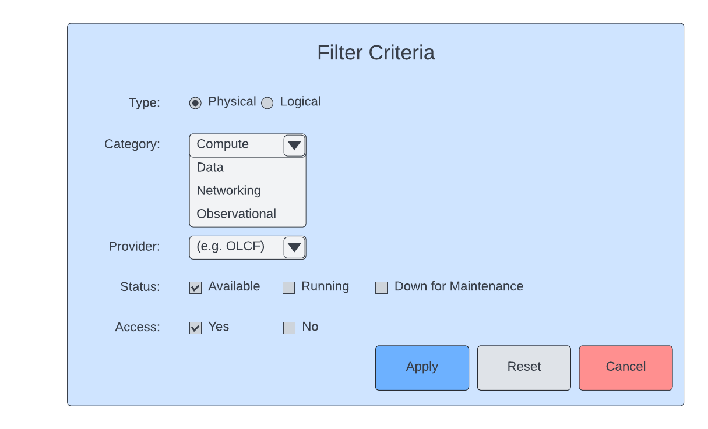

.. _`intersect:arch:sos:user:interfaces:user:servicecatalog`:

Service Catalog
~~~~~~~~~~~~~~~

.. _`intersect:arch:sos:user:interfaces:user:servicecatalog:preconditions`:

Preconditions
^^^^^^^^^^^^^

User is registered and logged into INTERSECT

.. _`intersect:arch:sos:user:interfaces:user:servicecatalog:postconditions`:

Postconditions
^^^^^^^^^^^^^^

User can view all available resources in INTERSECT and choose to use
discovered Resources in subsequent Campaigns.

.. _`intersect:arch:sos:user:interfaces:user:servicecatalog:methodologies`:

Methodologies
^^^^^^^^^^^^^

This view should show a grid or listing of Resources available in
INTERSECT along with tools to search for or filter Resources to
efficiently find Resource(s) of interest. Clicking on any resource in
the list would provide a detailed view of a given resource

* Listing view for each Resource should show:

  - Title
  - Thumbnail image or icon if applicable / available
  - (if relevant) User has access - Yes / No
  - (if relevant) Status symbol / color / message (Available / Down / in use...)
  - Search bar to find Resource by keywords, type, ID, Owner, etc...

* Search and filter options

  - Search box to search by any details that describe Resources (title, keywords, etc.)
  - Filters for:

    * Physical / logical Resource
    * Category of Physical or Logical Resource

      - E.g. Physical resources - Compute, Data, Networking, Observational

    * Provider - Organization (E.g. OLCF)
    * Status - whether the Resource is Available, Down for maintenance, etc.
    * Access - whether this User (and implicitely the projects they are part of) can access each of the displayed Resources

An example interface is depicted in :numref:`figures:user:user:servicecatalog:servicecat` and :numref:`figures:user:user:servicecatalog:servicecat-filters`.

   A list of the most common resources is shown.

   Filters can be applied to specify a search.
