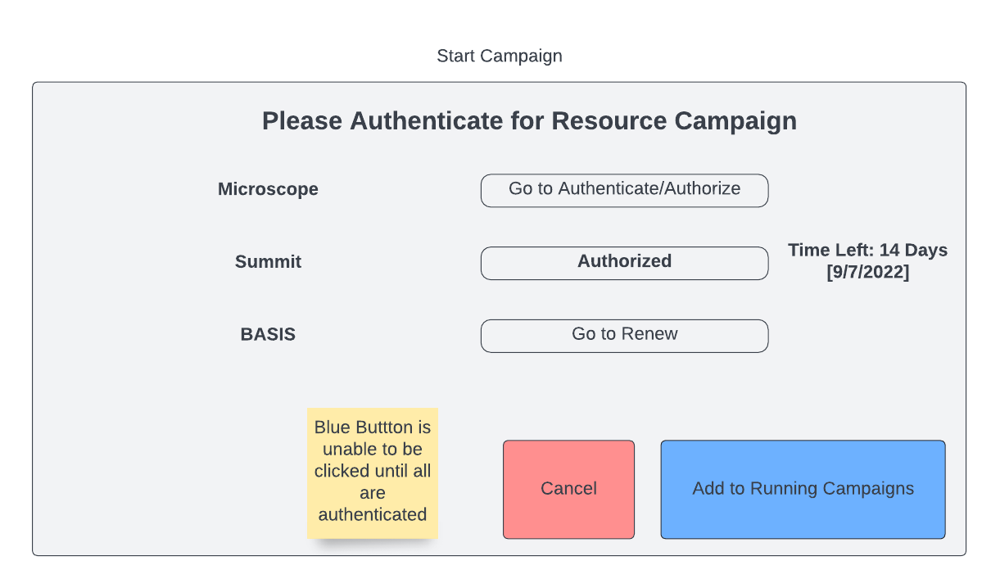

.. _`intersect:arch:sos:user:interfaces:user:startcampaign`:

Start Campaign
~~~~~~~~~~~~~~

.. _`intersect:arch:sos:user:interfaces:user:startcampaign:preconditions`:

Preconditions
^^^^^^^^^^^^^

The User is logged into INTERSECT and has been notified that the
scheduled campaign in ready.

.. _`intersect:arch:sos:user:interfaces:user:startcampaign:postconditions`:

Postconditions
^^^^^^^^^^^^^^

The user has authenticated the resource(s) needed in order to start the
campaign and the user can see the running campaign dashboard.

.. _`intersect:arch:sos:user:interfaces:user:startcampaign:methodologies`:

Methodologies
^^^^^^^^^^^^^

* User is notified via email about INTERSECT being ready for the Campaign and is reminded 10-15 minutes before the actual start time
* User logs back into INTERSECT
* User views list of pending Campaigns from the homepage
* User selects appropriate Campaign (perhaps this surfaces up by itself on the home screen so the previous steps can be avoided)
* User elects to start the Campaign when the time to start the Campaign has arrived
* User is shown a list of resources that require them to authenticate / authorize

  - User is taken to the specific resource’s page to authenticate / authorize
  - This process completes until all resources in the list are fully authenticated /authorized
  - The status needs to be pulled from the resource as opposed to whether or not the User went through INTERSECT to complete the process
  - User views auth tokens / certificates for resources and renews

* User is taken to the running Campaign dashboard view
* User monitors state of running Campaign passively

  - User may be notified out-of-band (email / SMS) according to their configuration
  - User views the live dashboard if they choose to

An example interface is depicted in :numref:`figures:user:user:startcampaign:campstart`.

   User authenticates resource for the campaign.
