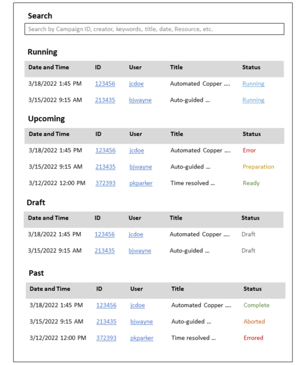

.. _`intersect:arch:sos:user:interfaces:user:viewcampaigns`:

User Views List of Campaigns
~~~~~~~~~~~~~~~~~~~~~~~~~~~~

.. _`intersect:arch:sos:user:interfaces:user:viewcampaigns:preconditions`:

Preconditions
^^^^^^^^^^^^^

User is registered and logged into INTERSECT

.. _`intersect:arch:sos:user:interfaces:user:viewcampaigns:postconditions`:

Postconditions
^^^^^^^^^^^^^^

User has knowledge about the Campaigns they are involved in, in addition
to being able to create a new Campaign.

.. _`intersect:arch:sos:user:interfaces:user:viewcampaigns:methodologies`:

Methodologies
^^^^^^^^^^^^^

This view should be a listing view with the following information per Campaign:

* Date and time of Campaign
* Campaign ID
* Link to view more details about the campaign
* User who is the primary point of contact for this Campaign
* Abbreviated / short title
* Status - this field would be represented differently based on the state of the Campaign:

  - Ongoing Campaigns - link to jump directly into the live monitoring dashboard for the Campaign
  - Scheduled / upcoming Campaigns - aggregated or lowest common denominator status of all major resources, and processes (e.g. approval from PI), marked by symbols and colors. This would be a single value denoting the weakest link in the chain.
  - Draft - Status: marked as Draft. No options / variations

This view should also provide the User the ability to search for Campaigns by the original composer (User), title, keywords, date, etc.

An example interface is depicted in :numref:`figures:user:user:viewcampaigns:ex1`.

   A high-level view representing past, present, and future scientific
   Campaigns that this user has been part of.
