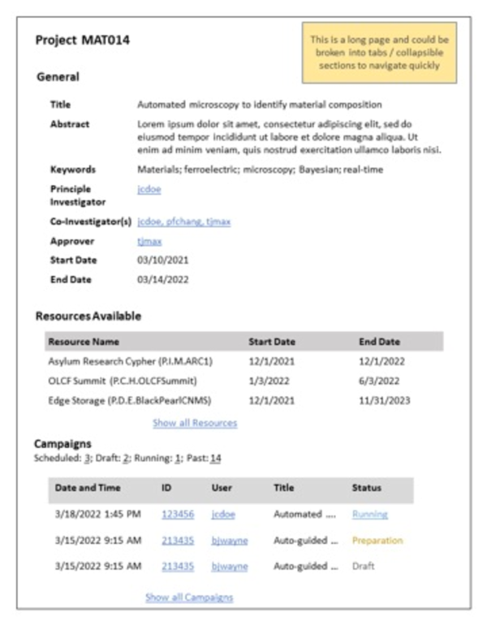

.. _`intersect:arch:sos:user:interfaces:user:viewproject`:

User Views Project
~~~~~~~~~~~~~~~~~~

.. _`intersect:arch:sos:user:interfaces:user:viewproject:preconditions`:

Preconditions
^^^^^^^^^^^^^

User is registered and logged into INTERSECT. User is part of the
project being viewed or User is an INTERSECT administrator.

.. _`intersect:arch:sos:user:interfaces:user:viewproject:postconditions`:

Postconditions
^^^^^^^^^^^^^^

User can review information about the project.

.. _`intersect:arch:sos:user:interfaces:user:viewproject:methodologies`:

Methodologies
^^^^^^^^^^^^^

This view should show information about the Project with:

* Basic information

  - Title
  - Abstract
  - Keywords
  - Principal investigator, co-investigator, others
  - Approvers for campaigns
  - Start and end date for Project
  - Resources available to Project
  - Campaigns (past, present, and future) that are part of this project.

An example interface is depicted in :numref:`figures:user:user:viewproject:ex1`.

   A representation of a User’s project view..
