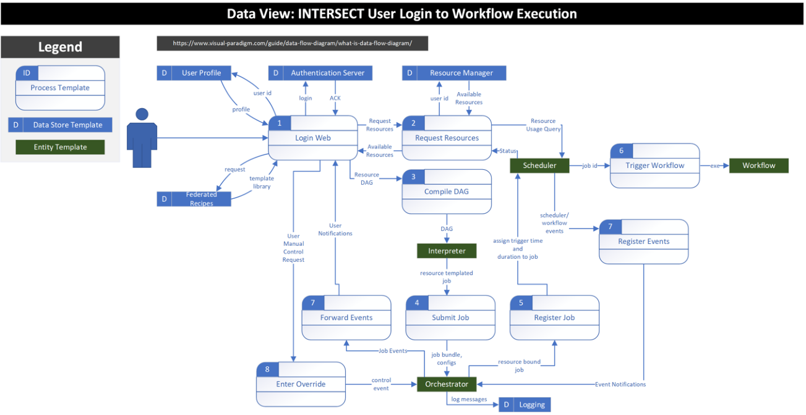

.. _intersect:arch:sos:user:processes:login:

Login Web
=========

:numref:`intersect:arch:sos:user:processes:login:process` applies to this and
following use cases.

The login process is responsible for receiving user login information,
authenticating the user, and loading an associated user profile.
Authentication is delegated to an Authentication Server that receives
appropriate credentials and returns an acknowledgment upon valid user
credentials or an error message given invalid user credentials. The
process of loading a user profile is more complicated. A user profile is
a collection of metadata that corresponds to remembered state and
preferences for a particular user. Specifically, to INTERSECT, a user
profile contains information about who the user is, what resources they
care about, and collections of helpful logical recipes.

Drilling into resources, a user profile is a registry that contains
connection criteria, file paths, etc. that are referenced using
key-value criteria. This allows for the user to apply friendly names or
aliases to resources much like a user creating custom names for web
bookmarks. However, unlike URLs resources within the user profile may be
more complicated such as they may cache connection criteria to databases
and have saved queries to views within that database. Similarly, they
could represent a file and a location within the file. Additionally,
resources could be an index of user history analogous to a history
within a UNIX bash console.

Drilling into the context of logical recipes, the user profile may
record collections of templated activities that are commonly observed
from the user’s activities. For example, if a user is commonly copying
files from one location to another, the system may record a “copy
recipe” that ask much the same as a template. It basically says, I’ve
seen you do this type of activity before if you need to do it again I’ll
help you. Consider a use case where a scientist has a multistep process
within their history for setting up an experiment. Maybe the scientist
must first copy a configuration file from a staging location to an
instrument such as updating firmware settings. Then the scientist needs
to move data to that local machine and allocate a compute node. Finally,
the scientist needs to load the machine and execute a pipeline. Each of
these might be independent line items within their history, but the
system is smart enough to take collections of items within the history
and build a directed acyclic graph from them. This graph is then
represented as a template using the pre-existing state. The next time
that a user wants to perform a similar operation, they can look in their
templates section of their user profile and select a template that the
system has learned from their history. Upon selecting this template, the
directed acyclic graph is color-coded to illustrate when the state is
preloaded example state or if it has been updated by the user. For
example, the background of a directed acyclic graph node might be white
for default state and green for updated state. The goal here is to aid
the user in being methodical and helping avoid human error. Similarly,
as the user uses the system more, the system learns more about how the
user works and adapts so that the user can be ever more efficient in
their activities.

Another aspect to a user profile is the means of sharing subsets between
users. For example, if a user is doing something complicated such as
installing Linux, it is very difficult and error-prone unless the
explicit commands are shown. The ability to share these types of
commands or scripts enables users to onboard and become effective
quickly by bootstrapping off one another.

   Login process for :term:`INTERSECT` users.

Preconditions
-------------

-  The URL https://intersect.ornl.gov/ must be live.

-  User has a valid and active ORNL account.

-  Authentication Server is live and reachable.

-  User Profile Service is live (optional, but preferred).

-  Federated Recipes is live (optional, but preferred).

Post-conditions
---------------

-  A user is verified against their username and password credentials.

-  If the User Profile Service is active, the user will have access to
   all of their predefined state, such as history and bookmarks.

-  If the Federated Recipes is live, the user will have access to a
   collection of templated directed acyclic graphs that are either
   standardized by a community or derived from an individual user’s
   rolling history.
