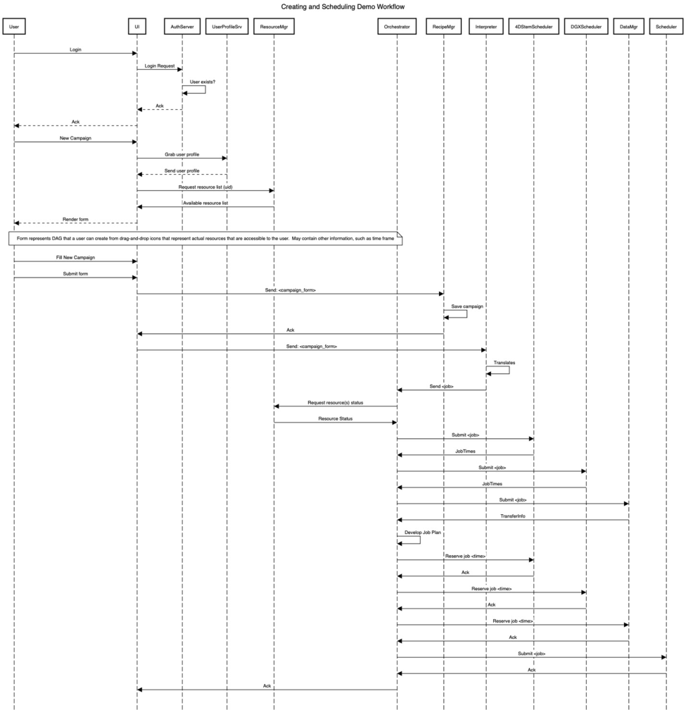

.. _INTERSECT:arch:user:processes:sequence:component-registration:

Sequence diagrams
=================

This section contains sequence diagrams for some example INTERSECT system interactions. These are designed to show which components in an INTERSECT system exchange messages for particular interactions.

Registering a component
-----------------------

A sequence diagram depicting messages for registering an INTERSECT component
is shown below.

.. _figures:user:processes:sequence:component-registration:
.. figure:: fig-component-registration.png
   :align: center
   :width: 800

   Sequence diagram for INTERSECT component registration.

User Login
----------

.. _sections:user:processes:sequence:user-login:

A sequence diagram depicting messages for user login is shown below.

.. _figures:user:processes:sequence:user-login:
.. figure:: fig-user-login.png
   :align: center
   :width: 800

   Sequence diagram for user login in INTERSECT.

   
Creating and Scheduling a Campaign
----------------------------------

.. _sections:user:processes:sequence:creating-scheduling:

A sequence diagram depicting messages for a user to create and schedule a
campaign to run on the INTERSECT ecosystem is shown below.

.. _figures:user:processes:sequence:creating-scheduling:

   Sequence diagram for creating and scheduling a campaign in INTERSECT.
   
Running a Campaign
------------------

.. _sections:user:processes:sequence:running:

A sequence diagram depicting messages for a user to run a
campaign to run on the INTERSECT ecosystem is shown below.

.. _figures:user:processes:sequence:running:

            
   Running a campaign in INTERSECT.

   
..
 vim:tabstop=4:shiftwidth=4:expandtab:textwidth=76:filetype=rst

..
 Local Variables:
 mode: rst
 fill-column: 76
 tab-width: 4
 indent-tabs-mode: nil
 End:
