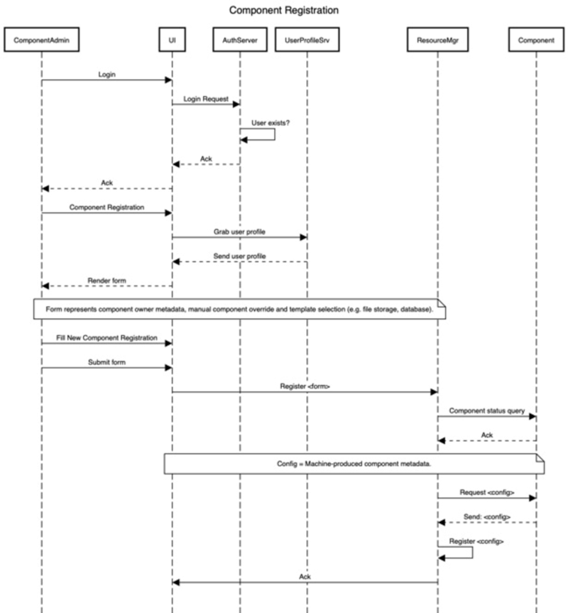
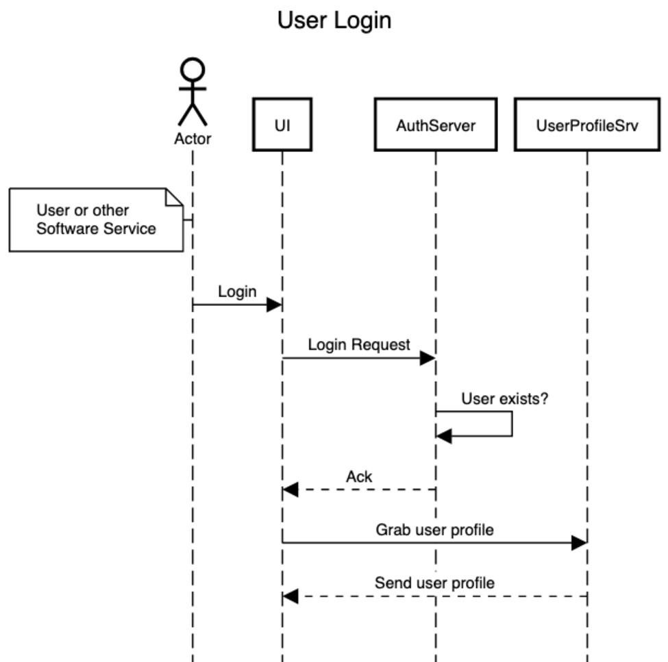
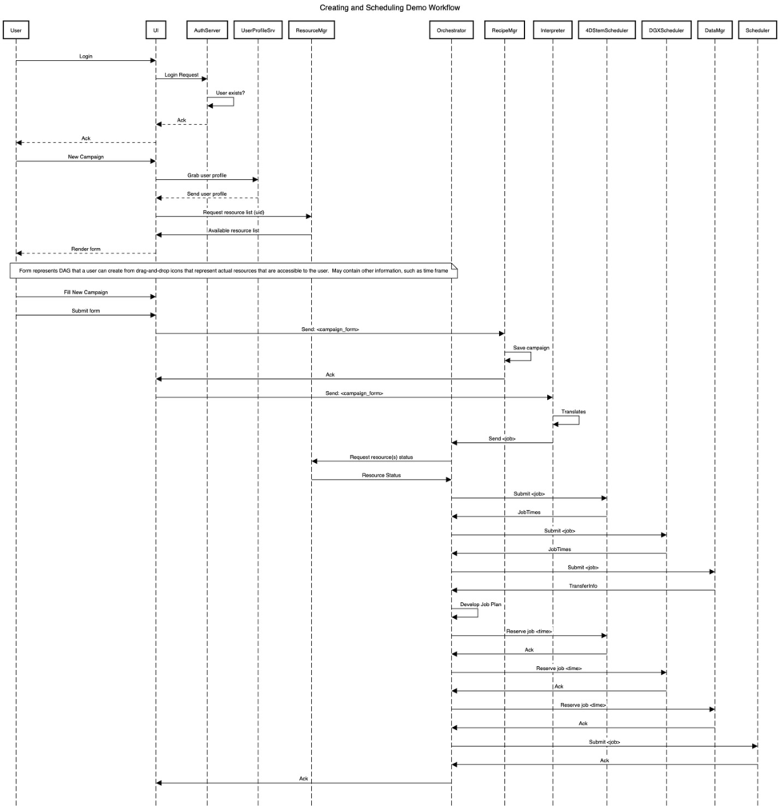
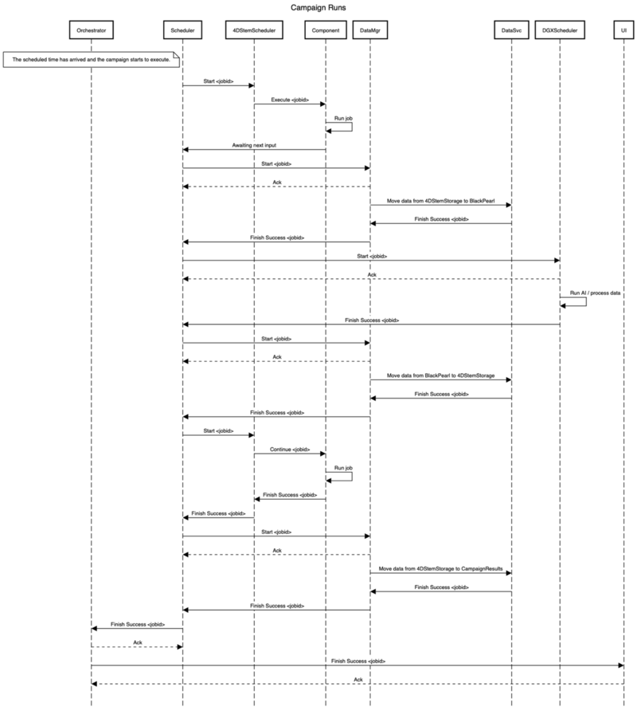

.. _intersect:arch:sos:user:processes:sequences:

Sequence Diagrams
=================

This section contains sequence diagrams for some example :term:`INTERSECT`
system interactions. These are designed to show which components in an
:term:`INTERSECT` system exchange messages for particular interactions.

.. _intersect:arch:sos:user:processes:sequences:registration:

Registering a Component
-----------------------

A sequence diagram depicting messages for registering an :term:`INTERSECT`
component is shown below.

   Sequence diagram for :term:`INTERSECT` component registration.

.. _intersect:arch:sos:user:processes:sequences:login:

User Login
----------

A sequence diagram depicting messages for user login is shown below.

   Sequence diagram for user login in :term:`INTERSECT`.

.. _intersect:arch:sos:user:processes:sequences:creating_scheduling:

Creating and Scheduling a Campaign
----------------------------------

A sequence diagram depicting messages for a user to create and schedule a
campaign to run on the :term:`INTERSECT` ecosystem is shown below.

   Sequence diagram for creating and scheduling a campaign in
   :term:`INTERSECT`.

.. _intersect:arch:sos:user:processes:sequences:running:
   
Running a Campaign
------------------

A sequence diagram depicting messages for a user to run a campaign to run on
the :term:`INTERSECT` ecosystem is shown below.

            
   Running a campaign in :term:`INTERSECT`.
